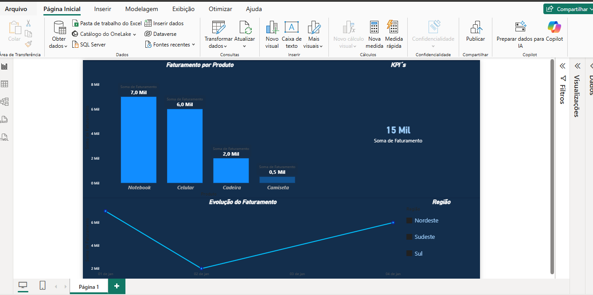

# 📊 Dashboard de Vendas (Power BI)

## 📌 Objetivo

Analisar o faturamento de vendas e identificar padrões para apoiar a tomada de decisão.

---

## 📷 Visual do Projeto

---

## 📊 Indicadores analisados

* Faturamento total
* Faturamento por produto
* Evolução do faturamento ao longo do tempo
* Filtro por região

---

## 🧠 Principais Insights

* Receita concentrada em Notebook e Celular
* Queda significativa nas vendas no período intermediário
* Recuperação no final do período
* Produtos com baixa performance identificados

---

## 🛠 Ferramentas utilizadas

* Power BI
* Excel

---

## 🎯 Diferenciais do projeto

* Design profissional com foco em legibilidade
* Uso de cores e contraste para melhor visualização
* Organização de dados e estrutura de projeto
