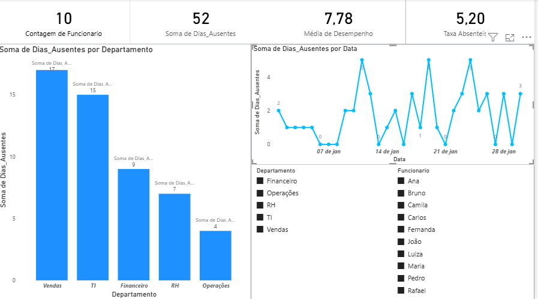

# 👥 Dashboard de RH - Absenteísmo (Power BI)

## 📌 Objetivo

Analisar o comportamento de absenteísmo dos colaboradores, identificando padrões e impactos na produtividade.

---

## 📷 Visual do Projeto

---

## 📊 Indicadores analisados

* Total de funcionários
* Total de dias ausentes
* Média de desempenho
* Taxa de absenteísmo

---

## 📈 Análises realizadas

### Faltas por departamento

Identificação das áreas com maior volume de ausências, com destaque para Vendas e TI.

### Evolução ao longo do tempo

Análise da variação diária das faltas, evidenciando comportamento irregular.

---

## 🧠 Principais Insights

* Vendas e TI concentram maior absenteísmo
* Ausências ocorrem de forma pontual
* Desempenho médio permanece estável
* Necessidade de monitoramento contínuo

---

## 🛠 Ferramentas utilizadas

* Power BI
* Excel

